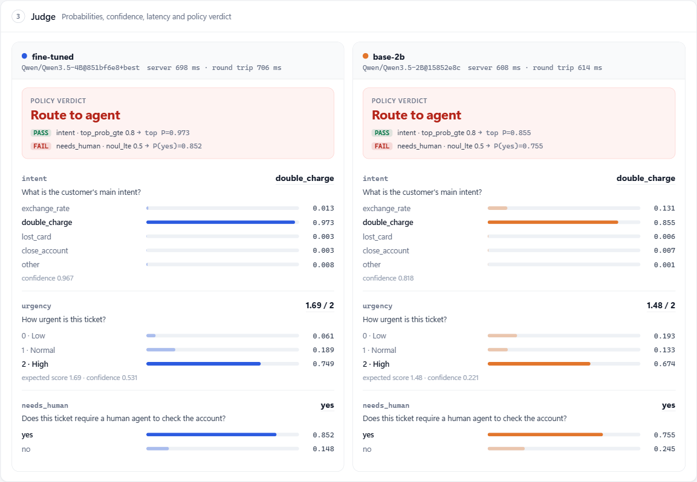
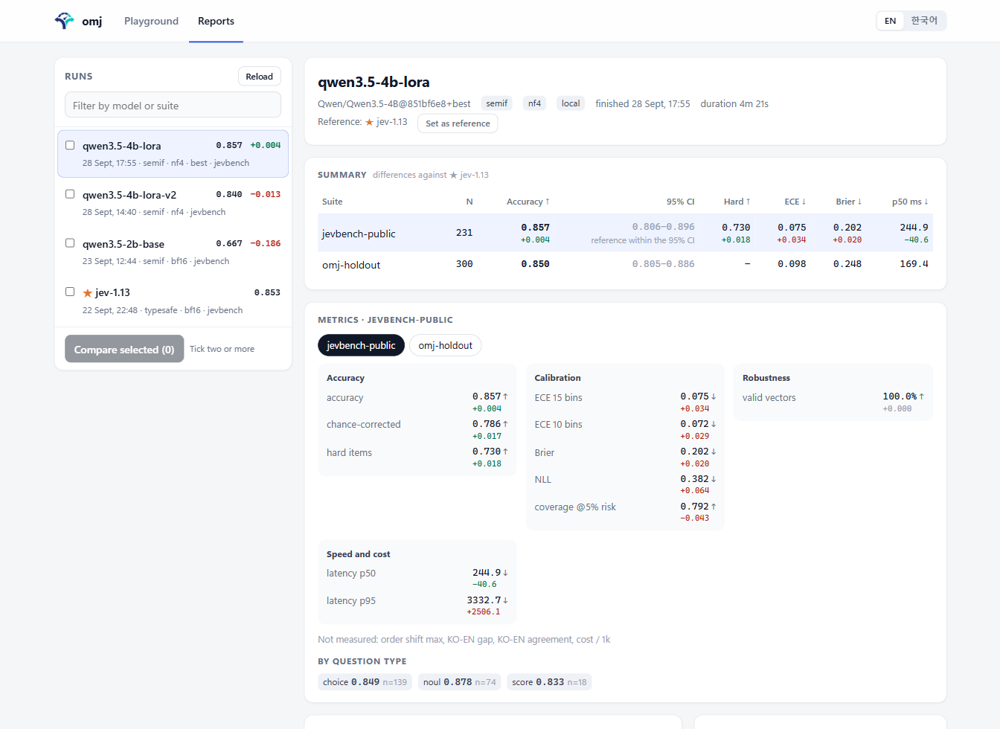
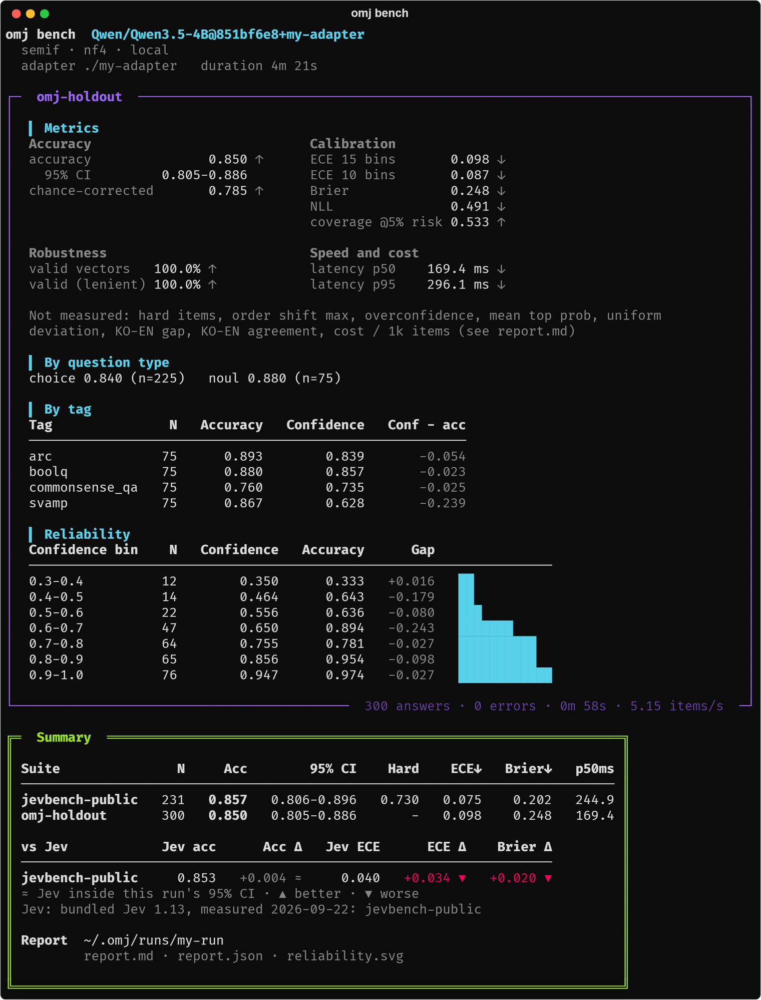
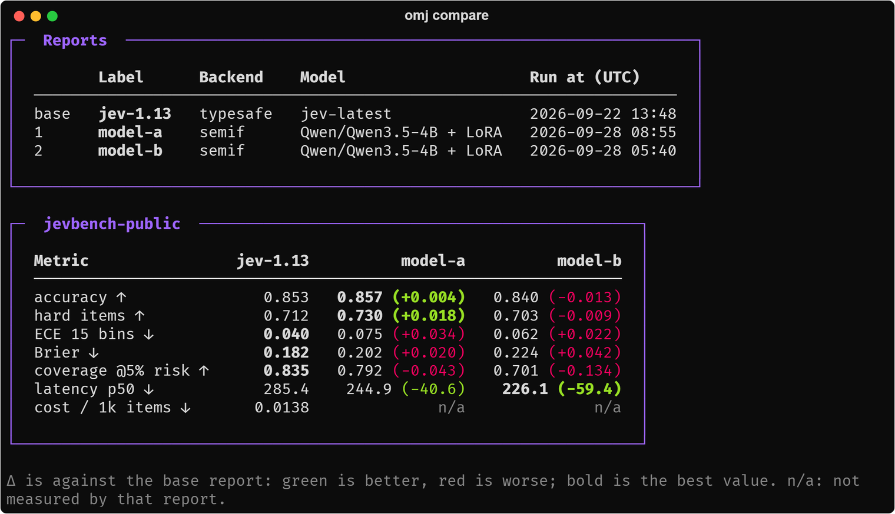

<div align="center">

<picture>
  <source media="(prefers-color-scheme: dark)" srcset="docs/images/logo-dark.png">
  
</picture>

# oh-my-jev

**Jev 스타일 모델을 가장 쉽게 실험하고, 벤치마크하고, 직접 학습해 보세요.**

웹 플레이그라운드에서 *System One* 판단 모델을 바로 써 보고, Jev와 비교해 정확도와 보정을 측정하고, JSONL 파일 하나로 나만의 모델을 미세조정할 수 있습니다. 판단 모델은 정해진 질문에 자유 문장 대신 보정된 확률로 답하는 모델입니다.

[](LICENSE)
[](pyproject.toml)
[](https://github.com/iamupd/oh-my-jev/releases)
[](#typesafe-sdk로-연결)

[빠른 시작](#빠른-시작) · [명령](#명령) · [스위트](#벤치마크-스위트) · [학습](#판단-모델-직접-학습) · [알려진 제한](#알려진-제한) · [English](README.md)


<br><sub>웹 플레이그라운드: 두 모델이 같은 문의를 판단하고 확률과 정책 판정을 보여 줍니다(<code>omj ui</code>)</sub>
<br><br>

<br><sub>리포트 화면: 모든 실행을 Jev와 비교하고 95% 신뢰구간, 태그별 약점, 신뢰도를 보여 줍니다(<code>omj bench --view</code>)</sub>
<br><br>

<br><sub>터미널: 같은 결과를 <code>omj bench</code>에서 바로 확인할 수 있습니다</sub>

</div>

## 왜 필요한가요

에이전트는 하루에도 작은 판단을 수없이 내립니다. *이 문의는 어느 팀으로 보낼까? 이 답변은 근거가 있을까? 사람이 한 번 확인해야 할까?*

- 생성된 문장에는 기준으로 삼을 값이 없습니다.
- 판단 모델은 선택지마다 확률을 주기 때문에, 0.9 이상이면 자동으로 처리하고 그 아래는 사람에게 넘길 수 있습니다. 물론 그 확률이 정직해야겠죠.
- oh-my-jev는 바로 이 과정을 위한 도구입니다. TypeSafe 호환 엔드포인트로 서빙하고, 정확도와 **보정**을 함께 측정하고, 직접 학습하고, 기준 모델과 비교해 보세요.

## 주요 특징

- 🚀 **순전파 1회로 판독.** 로컬 모델은 순전파 한 번의 선택지 레이블 로짓으로 답합니다. 문장을 생성하지 않으니 판단 1건에 prefill 1회면 충분합니다.
- 🎯 **정확도만이 아니라 보정까지.** ECE, Brier, NLL, 위험 5% 기준 커버리지, 신뢰도 표, 95% 신뢰구간, 온도 보정을 제공합니다.
- 🔌 **그대로 연결되는 엔드포인트.** `omj serve`는 TypeSafe의 `/v1/systemone` 형식을 따르므로, 공식 SDK에서 `base_url`만 바꾸면 됩니다.
- 🧪 **직접 학습.** 레이블 한정 교차엔트로피와 Brier 항을 쓰는 LoRA / QLoRA 레시피를 제공하고, 작은 GPU를 위한 4-bit 로딩도 지원합니다.
- ⚖️ **Jev와 비교.** 모든 결과에 Jev 대비 차이가 표시되고, 95% 신뢰구간 안이면 `≈`로 알려 드립니다. 터미널이나 리포트 화면에서 실행을 비교하고, 웹 플레이그라운드에서는 한 상황을 여러 모델에 보내 볼 수 있습니다(영어 / 한국어).
- 🧰 **설치하자마자 동작.** mock 백엔드는 GPU도 키도 필요 없어서, 모델을 받기 전에도 모든 명령을 실행해 볼 수 있습니다.

## 빠른 시작

[uv](https://docs.astral.sh/uv/)와 Python 3.11 이상이 필요합니다.

```bash
git clone https://github.com/iamupd/oh-my-jev.git
cd oh-my-jev
uv sync --extra dev
uv run omj init --yes                 # GPU와 키를 감지해 ~/.omj/config.toml을 만듭니다
uv run omj bench --suite omj-smoke --view    # 30문항을 실행하고, --view로 결과를 브라우저에서 엽니다
uv run omj serve                      # http://127.0.0.1:8799, Ctrl+C로 종료합니다
```

그다음 두 번째 터미널에서 요청을 보내 보세요.

```bash
curl -s http://127.0.0.1:8799/v1/systemone -H "Content-Type: application/json" -d '{"model": "jev-latest", "state": "Customer: I was charged twice.", "questions": {"team": {"type": "choice", "instructions": "Which team?", "criteria": {"billing": "payment problems", "shipping": "delivery problems"}}}}'
```

<details>
<summary>Windows PowerShell</summary>

PowerShell에서는 `curl`이 `Invoke-WebRequest`의 별칭이라서, 같은 요청을 이렇게 보내면 됩니다.

```powershell
$body = '{"model": "jev-latest", "state": "Customer: I was charged twice.", "questions": {"team": {"type": "choice", "instructions": "Which team?", "criteria": {"billing": "payment problems", "shipping": "delivery problems"}}}}'
Invoke-RestMethod -Method Post -Uri http://127.0.0.1:8799/v1/systemone -ContentType "application/json" -Body $body | ConvertTo-Json -Depth 5
```

</details>

<details>
<summary><code>omj init</code>은 백엔드를 이렇게 고릅니다</summary>

- 6~24 GB CUDA GPU가 있고 `semif` extra가 설치되어 있으면 로컬 Qwen3.5 모델을 씁니다([로컬 모델 실행](#로컬-모델-실행) 참고).
- `semif` extra가 없으면, `JEV_KEY`나 `OPENROUTER_KEY`가 있을 때는 원격 백엔드를, 없을 때는 mock 백엔드를 쓰고 로컬 모델을 켜는 방법을 알려 드립니다.
- 직접 정하고 싶다면 `uv run omj init --yes --backend mock`(또는 `typesafe`, `semif`)처럼 지정하세요.
- `omj bench`는 `--backend NAME`, `--endpoint URL`, `--model org/name`, `--adapter <폴더>`를 주지 않으면 설정 파일의 백엔드를 씁니다(`--model`과 `--adapter`는 로컬 semif로 실행됩니다).

</details>

## 명령

| 명령 | 기능 |
|---|---|
| `omj init` | 하드웨어·키 감지, 동작 확인, `~/.omj/config.toml` 생성 |
| `omj serve` | 로컬 모델·원격 API·mock 위에 TypeSafe 호환 `/v1/systemone` 엔드포인트 제공 |
| `omj bench` | 정확도, 보정, 유형별·태그별 분해, 신뢰도 표, Jev 대비 차이를 `report.md`와 `report.json`으로 저장. `--view`로 리포트 화면에서 바로 확인 |
| `omj compare` | 보고서 2개 이상을 나란히 놓고 첫 번째와의 차이 표시 |
| `omj train` | TOML 레시피로 LoRA / QLoRA 미세조정. 직접 만든 JSONL 판단 데이터와 공개 데이터셋 사용 |
| `omj ui` | 여러 모델을 비교하는 로컬 웹 플레이그라운드(정책 임계값 포함)와 완료된 실행을 보는 리포트 화면 |

각 명령은 `uv run omj …`로 실행합니다. `.venv`를 활성화했다면 `omj …`만 입력해도 됩니다.

| 백엔드 | 동작 | 필요한 것 |
|---|---|---|
| `semif` | 오픈 가중치를 직접 로드해 선택지 로짓을 판독. LoRA adapter 적용 가능 | CUDA GPU, `uv sync --extra semif` |
| `typesafe` | 호스팅된 Jev API를 직접 또는 OpenRouter를 거쳐 호출 | `JEV_KEY` 또는 `OPENROUTER_KEY` |
| `kev` | 실행 중인 [Kev](https://github.com/jaredpalmer/kev) 서버 호출 | Kev 서버 |
| `mock` | 키워드 겹침으로 점수 계산. 모델이 아닌 테스트용 | 없음 |

## 벤치마크 스위트

`--suite`로 하나 이상 골라 주세요(여러 번 지정할 수 있습니다). 기본값은 `omj-smoke`입니다. `--model org/name`, `--adapter <폴더>`, `--backend`로 모델을 따로 지정하지 않으면 `omj init`에서 설정한 모델로 실행됩니다.

| 스위트 | 측정 내용 | 규모 | 내장 Jev 값 | 데이터 |
|---|---|---|---|---|
| `omj-smoke` | 라우팅, 감성, 안전 등 작은 판단을 빠르게 확인 | 30 | 있음 | 내장 |
| `jevbench-public` | JevBench 공개 문항: 긴 규정, 추출, 다단계 추론, 날짜 계산 등 쉬움·보통·어려움 단계의 판단 | 231 | 있음 | JevBench 저장소에서 한 번 내려받음(고정 커밋) |
| `omj-holdout` | BoolQ, ARC-Challenge, CommonsenseQA, SVAMP의 분포 밖 문항. 체크포인트 선택용 | 300 | 없음 | 내장 |
| `massive-ko` / `massive-en` | MASSIVE 1.1 고정 표본의 한국어 / 영어 의도·시나리오 분류. 둘 다 돌리면 한영 차이도 계산 | 각 600 답변 | 있음 | MASSIVE 1.1 압축 파일을 한 번 내려받음(체크섬 확인) |
| `underdetermined` | 정답이 없는 문항. 정확도 대신 과신 정도를 측정 | 20 | 있음 | 내장 |
| `order` | 함께 실행한 첫 번째 스위트의 choice 문항을 선택지 순서만 섞어 다시 실행. 확률이 얼마나 흔들리는지 측정 | 문항당 5회 | 없음 | 파생 |
| `all` | 위 스위트 전부 | | | |
| `path/to/file.jsonl` | 같은 형식으로 직접 만든 판단 데이터([직접 학습](#판단-모델-직접-학습) 참고). 파일 이름으로 보고됨 | 자유 | 없음 | 사용자 |

```bash
uv run omj bench --model Qwen/Qwen3.5-2B --suite jevbench-public --suite omj-holdout --view   # 가장 정보가 많은 두 스위트
uv run omj bench --model Qwen/Qwen3.5-2B --suite massive-ko --suite massive-en                 # 한영 차이와 일치율도 함께
uv run omj bench --suite jevbench-public --suite order        # omj init에서 설정한 모델 + 선택지 순서 견고성
```

## Jev 및 다른 실행과 비교

모든 `omj bench` 결과 끝에는 **vs Jev** 표(정확도·ECE·Brier 차이)가 나오고, `report.md`와 리포트 화면에도 같은 비교가 담깁니다. Jev 수치는 다음 순서로 가져옵니다.

1. 같은 스위트를 측정한 로컬 Jev 실행
2. `JEV_KEY`나 `OPENROUTER_KEY`가 있다면 같은 문항으로 Jev를 새로 측정합니다(한 번만 실행해 `~/.omj/runs/jev-reference-*`에 저장하고 다음부터 재사용합니다).
3. omj에 내장된 Jev 1.13 값(JevBench public, MASSIVE ko/en, omj-smoke. omj 작성자가 2026-09-22에 측정한 값이며 TypeSafe 공식 수치는 아닙니다)

- `≈`는 Jev가 이 실행의 95% 신뢰구간 안에 있어 유의한 차이가 아니라는 뜻이고, `▲`/`▼`는 더 좋음/나쁨을 뜻합니다.
- `--reference none`으로 표를 끌 수 있고, `--reference <report.json>`으로 다른 실행과 비교할 수도 있습니다.

완료된 실행을 나란히 놓고 보고 싶다면:

```bash
uv run omj compare jev/report.json run-a/report.json run-b/report.json --labels jev-1.13,model-a,model-b --out runs/cmp
```

<div align="center">

</div>

- 차이는 지표의 방향에 맞춰 색으로 표시됩니다(초록이 더 좋음). 행마다 가장 좋은 값은 굵게 보여 드립니다.
- 위 수치는 2026년 9월 JevBench 공개 문항 231개로 측정한 값입니다. 리포트 화면에서도 선택한 실행을 같은 방식으로 비교할 수 있습니다.

## 로컬 모델 실행

```bash
uv sync --extra semif --extra dev    # torch, transformers, peft를 설치합니다(수 GB)
uv run omj init --yes                # 6~24 GB CUDA GPU라면 Qwen3.5 기반 모델을 내려받습니다(2B는 약 4.5 GB)
uv run omj serve
```

- `--no-download`를 주면 가중치는 받지 않고 설정만 저장합니다.
- bf16으로 GPU에 들어가지 않는 모델은 자동으로 4-bit(nf4)로 로드합니다. 직접 정하려면 `uv run omj init --quant nf4`를 쓰세요.

## Hugging Face 모델 벤치마크

`--model`에 모델 ID만 넣으면 됩니다. 처음 사용할 때 모델을 내려받고, 선택지 프롬프트를 만들어 레이블 토큰 확률을 읽습니다. 학습하지 않은 모델도 비교할 수 있는 zero-shot 점수가 나오고, 설정 파일은 필요 없습니다.

```bash
uv run omj bench --model Qwen/Qwen3.5-0.8B --suite jevbench-public --suite omj-holdout --out runs/qwen-0.8b
uv run omj bench --model Qwen/Qwen3.5-2B   --suite jevbench-public --suite omj-holdout --out runs/qwen-2b
uv run omj compare runs/qwen-0.8b/report.json runs/qwen-2b/report.json --labels qwen-0.8b,qwen-2b --out runs/cmp
```

<details>
<summary>어떤 모델을 쓸 수 있나요?</summary>

- 토크나이저가 `" A"`, `" B"` …를 토큰 1개로 인코딩하는 `AutoModelForCausalLM` 체크포인트라면 됩니다. `trust_remote_code`가 필요한 모델은 로드하지 않습니다.
- 기본은 bf16으로 로드하고, 모델 이름의 크기 표기(예: `4B`)로 보아 GPU에 들어가지 않으면 4-bit로 로드합니다.
- LoRA adapter 저장소도 됩니다. `--model your-org/your-lora-adapter`처럼 주면 adapter를 받아 학습에 쓰인 기반 모델 위에 올립니다. 로컬 adapter는 `--adapter <폴더>`로 같은 방식으로 쓰면 됩니다.
- Llama, Gemma 같은 게이트 모델은 먼저 `hf auth login`과 라이선스 동의가 필요합니다.
- 자체 프롬프트 형식으로 학습한 다른 프로젝트의 모델(Kev, Open-Jev 등)은 그 프로젝트의 서버로 측정하는 편이 정확합니다: `uv run omj bench --endpoint http://127.0.0.1:<포트>`

</details>

## 웹 플레이그라운드

상황 하나와 질문들을 여러 모델에 보내 확률을 나란히 비교하고, 정책 임계값도 적용해 보세요. 비교할 모델은 `--target`으로 지정합니다.

```bash
uv run omj ui                                                            # config.toml의 모델 (JEV_KEY가 있으면 Jev도 함께)
uv run omj ui --target Qwen/Qwen3.5-0.8B --target Qwen/Qwen3.5-2B       # Hugging Face 모델 두 개
uv run omj ui --target semif --target semif:~/.omj/adapters/<recipe>/<run_id>/best   # 원본 모델 대 내 adapter
uv run omj ui --target semif --target typesafe                            # 내 모델 대 호스팅 Jev API
```

| `--target` | 실행 내용 |
|---|---|
| `org/model` | 해당 Hugging Face 모델. 처음 사용할 때 내려받음 |
| `semif` | `config.toml`의 모델 |
| `semif:<adapter 폴더>` | 학습에 쓰인 기반 모델에 LoRA adapter를 올린 것 |
| `typesafe` / `kev` / `mock` | 호스팅 Jev API / Kev 서버 / 테스트용 대역 |
| `@<config.toml>` | 다른 설정 파일의 `[backend]` (고급) |

화면에 표시되는 이름은 실행 내용에서 자동으로 정해집니다(`qwen3.5-0.8b`, `semif`, adapter의 레시피 이름). 직접 정하고 싶다면 앞에 `이름=`을 붙이세요. 예: `--target baseline=Qwen/Qwen3.5-2B`

- `http://127.0.0.1:8800`에서 영어로 열립니다. 주소에 `?lang=ko`를 붙이거나 **EN / 한국어** 버튼을 누르면 한국어로 바뀝니다. 내장 예제 4종(메모리 승격, 코드 리뷰, 콘텐츠 정책, 고객 문의 라우팅)도 준비되어 있습니다.
- 대상마다 모델을 따로 로드하므로, GPU 메모리에 모두 올라갈 수 있어야 합니다.
- **리포트** 탭에서는 완료된 모든 실행(`~/.omj/runs`와 `--out`으로 지정한 폴더)을 볼 수 있습니다. 95% 신뢰구간을 포함한 요약, 태그별 약점, 신뢰도 도표, 선택한 실행의 나란히 비교까지 확인해 보세요. `omj bench --view`도 같은 화면을 여는데, 떠 있는 `omj ui`가 있으면 그것을 쓰고, 없으면 모델을 올리지 않는 리포트 전용 서버를 Ctrl+C를 누를 때까지 띄웁니다.

## 판단 모델 직접 학습

판단 데이터를 JSONL로 작성해 주세요. **한 줄에 JSON 객체 하나**, 즉 한 줄이 상황 하나이고, 벤치마크 스위트와 같은 형식입니다. 아래는 두 줄짜리 예시입니다(전체 예시 파일 [`examples/support-decisions.jsonl`](examples/support-decisions.jsonl)은 40줄, 팀 4개로 되어 있습니다).

```jsonl
{"id": "support-001", "tags": ["billing"], "state": {"channel": "email", "message": "I was charged twice this month."}, "questions": {"team": {"type": "choice", "instructions": "Which team should handle this ticket?", "criteria": {"billing": "Payments and refunds", "shipping": "Delivery problems"}}, "refund": {"type": "noul", "instructions": "Is the customer asking for money back?"}, "urgency": {"type": "score", "instructions": "How urgent is this ticket?", "criteria": ["Can wait a week", "Within a few days", "Today", "Blocking right now"]}}, "expected": {"team": "billing", "refund": "yes", "urgency": "2"}}
{"id": "support-002", "tags": ["shipping"], "state": {"channel": "chat", "message": "Where is my parcel? It should have arrived on Friday."}, "questions": {"team": {"type": "choice", "instructions": "Which team should handle this ticket?", "criteria": {"billing": "Payments and refunds", "shipping": "Delivery problems"}}, "refund": {"type": "noul", "instructions": "Is the customer asking for money back?"}, "urgency": {"type": "score", "instructions": "How urgent is this ticket?", "criteria": ["Can wait a week", "Within a few days", "Today", "Blocking right now"]}}, "expected": {"team": "shipping", "refund": "no", "urgency": "2"}}
```

| 필드 | 의미 |
|---|---|
| `id` | 줄마다 고유한 값 |
| `state` | 상황. 텍스트나 임의의 JSON 객체 |
| `questions` | 질문 하나 이상. `choice`: `criteria`에 선택지 키와 설명을 담은 사전. `noul`: 예/아니오 질문(`true`/`false` 설명을 담은 `criteria`는 선택). `score`: `criteria`에 0부터 시작하는 단계별 설명 목록 |
| `expected` | 질문별 정답: 선택지 키, `yes`/`no`, 또는 단계 번호(문자열). 정답이 없는 질문은 학습에서 빠지고, bench에서는 정답 없는 문항으로 처리됨 |
| `tags` | 선택 사항. 보고서에서 태그별 정확도를 보여 줌 |

레시피에 파일 경로를 넣고 학습하면 됩니다. 레시피는 TOML 파일이고, [`recipes/example-custom-en.toml`](recipes/example-custom-en.toml)을 그대로 출발점으로 써도 됩니다.

<details open>
<summary><code>recipes/example-custom-en.toml</code></summary>

```toml
# omj example recipe: example-custom-en
# Train on your own decisions: examples/support-decisions.jsonl (40 synthetic support tickets, CC0,
# three questions each) mixed with Banking77 so the adapter does not overfit a handful of items.
# Replace the jsonl path with your file; it uses the same format as the bench suites.
#
# Data: examples/support-decisions.jsonl (synthetic, CC0-1.0); Banking77 (PolyAI, CC-BY-4.0, downloaded at run time)

name = "example-custom-en"
base_model = "Qwen/Qwen3.5-0.8B"
revision = "2fc06364715b967f1860aea9cf38778875588b17"

[data]
source = "mix"
locale = "en-US"
shuffle_options = true

[[data.mix]]
name = "jsonl"
path = "../examples/support-decisions.jsonl"   # relative to this recipe file; train_n left out = every record
dev_n = 20

[[data.mix]]
name = "banking77"
train_n = 1000
dev_n = 50

[lora]
r = 8
alpha = 16
dropout = 0.05
target_modules = ["q_proj", "k_proj", "v_proj", "o_proj", "in_proj_qkv", "out_proj"]

[train]
lr = 2e-4
epochs = 2
batch_size = 4
grad_accum = 4
max_seq_len = 1024
label_smoothing = 0.05
brier_weight = 0.5
seed = 20260929
eval_every_steps = 50
```

</details>

| 절 | 설정 내용 |
|---|---|
| `name`, `base_model`, `revision` | 실행 이름(adapter는 `~/.omj/adapters/<name>/`에 저장)과 Hugging Face 기반 모델, 고정 리비전 |
| `[data]` | `source = "mix"`는 `[[data.mix]]` 항목들을 조합. `shuffle_options`는 학습 중 선택지 순서를 섞음 |
| `[[data.mix]]` | 데이터 출처마다 하나씩. `name = "jsonl"`과 `path`가 직접 만든 파일(레시피 기준 상대 경로). `train_n`은 뽑을 레코드 수(jsonl은 생략하면 전부), `dev_n`은 검증용 수 |
| `[lora]` | adapter 랭크, 스케일, 드롭아웃, 적용할 레이어 |
| `[train]` | 학습률, epoch, 배치 크기 × `grad_accum`(실효 배치), 문맥 길이, 보정용 `brier_weight`, 시드, 평가 주기 |

```bash
uv sync --extra semif --extra dev
uv run omj train --recipe recipes/example-custom-en.toml                    # 레시피 파일(경로는 자유)
uv run omj bench --adapter ~/.omj/adapters/example-custom-en/<run_id>/best --suite my-test.jsonl --view
```

`--recipe`에는 `.toml` 파일 경로를 주면 되고, `recipes/`에 들어 있는 레시피라면 이름만 줘도 됩니다(`--recipe example-custom-en`). 예시를 복사해 `name`과 `path`만 바꾼 뒤 `--recipe my-recipe.toml`로 실행해 보세요.

- 학습을 시작하기 전에 모든 줄을 검사합니다. 잘못된 줄이 있으면 줄 번호와 함께 알려 드립니다.
- 항목의 10%(`id` 기준)는 가장 좋은 체크포인트를 고르는 검증용으로 떼어 둡니다.
- `bench --suite my-test.jsonl`에 쓸 평가 파일은 따로 준비해 주세요. 학습 데이터가 내장 평가 스위트와 8단어 연속으로 겹치면 점수가 부풀려지므로 경고해 드립니다.
- 함께 섞을 수 있는 공개 데이터는 `massive`, `massive-en`, `banking77`, `klue-ynat`, `klue-nli`, `nsmc`, `openjev-business`입니다(처음 사용할 때 내려받습니다). [`recipes/example-intent-en.toml`](recipes/example-intent-en.toml)은 공개 데이터만 사용하는 예시입니다.
- `--adapter`를 주면 `bench`와 `serve`는 로컬 semif로 실행되고, 학습에 쓰인 기반 모델을 로드합니다. GPU에 들어가지 않으면 4-bit로 로드합니다.
- 체크포인트는 JevBench가 아니라 `omj-holdout`이나 직접 만든 평가 파일로 고르는 것을 권합니다. `omj-holdout`은 봉인된 시험 세트가 아니라 공개 개발용 세트입니다.

## TypeSafe SDK로 연결

```python
from typesafe_sdk import TypeSafeClient

client = TypeSafeClient(api_key="local", base_url="http://127.0.0.1:8799")
```

브라우저에서 모델을 나란히 비교하고 싶다면 [웹 플레이그라운드](#웹-플레이그라운드)를 참고하세요.

## 알려진 제한

- Windows 11과 NVIDIA GPU에서 테스트했습니다. Linux에서도 동작할 것으로 예상합니다. 로컬 모델은 CUDA가 필요해서 macOS에서는 지원하지 않습니다.
- `omj train`은 모든 문항을 `choice`로 보고 보정 온도를 학습합니다. 그래서 혼합 레시피의 yes/no·`score` 문항은 같은 온도를 공유합니다. 내장 예제는 `choice`만 사용합니다.
- MASSIVE 스위트와 학습은 처음 사용할 때 데이터를 내려받습니다.
- `omj compare`는 완성된 보고서를 비교할 뿐, 모델을 실행하거나 차이의 유의성을 검정하지는 않습니다. Jev 대비 `≈` 표시도 신뢰구간 확인이지 대응 검정은 아닙니다.
- 내장 Jev 값은 2026-09-22 기준 Jev 1.13입니다. 이후 버전의 Jev는 점수가 다를 수 있으니, 최신 수치가 필요하다면 키로 직접 측정해 보세요.

## 감사의 말

oh-my-jev는 아래 프로젝트들의 아이디어와 인터페이스를 바탕으로 만들었습니다(코드를 복사하지는 않았습니다).
[TypeSafe](https://docs.typesafe.ai) (System One 통신 규약과 SDK),
[SemIf](https://github.com/TheoLeeCJ/SemIf-OpenJev) (1회 순전파 선택지 로짓 판독),
[Kev](https://github.com/jaredpalmer/kev)와 [Open-Jev](https://github.com/Zefan-Cai/Open-Jev) (LoRA로 학습한 공개 판단 모델),
[JevBench](https://github.com/fstandhartinger/jevbench) (공개 문항과 채점 방식).

## 라이선스

코드는 [Apache-2.0](LICENSE)입니다. 번들 평가 데이터는 각자의 라이선스를 따릅니다([suites/NOTICE.md](suites/NOTICE.md)). 의존성과 데이터셋 목록은 [THIRD-PARTY.md](THIRD-PARTY.md)에서 확인하세요.

> TypeSafe AI와 제휴하거나 보증받은 프로젝트가 아닙니다. "Jev"와 "System One"은 TypeSafe AI가 사용하는 명칭이며, 이 프로젝트는 호환 인터페이스를 구현한 독립 프로젝트입니다.
